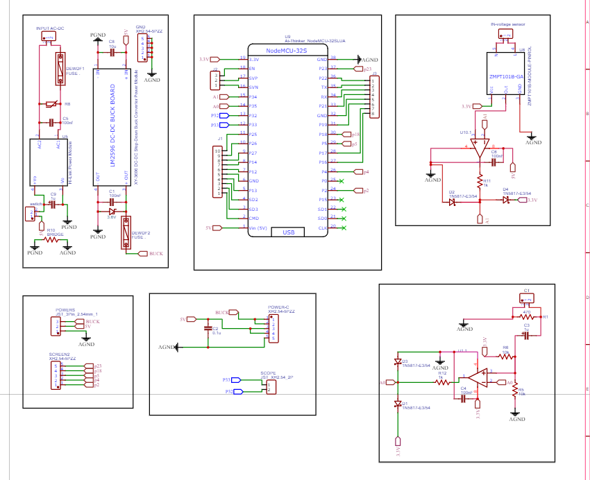
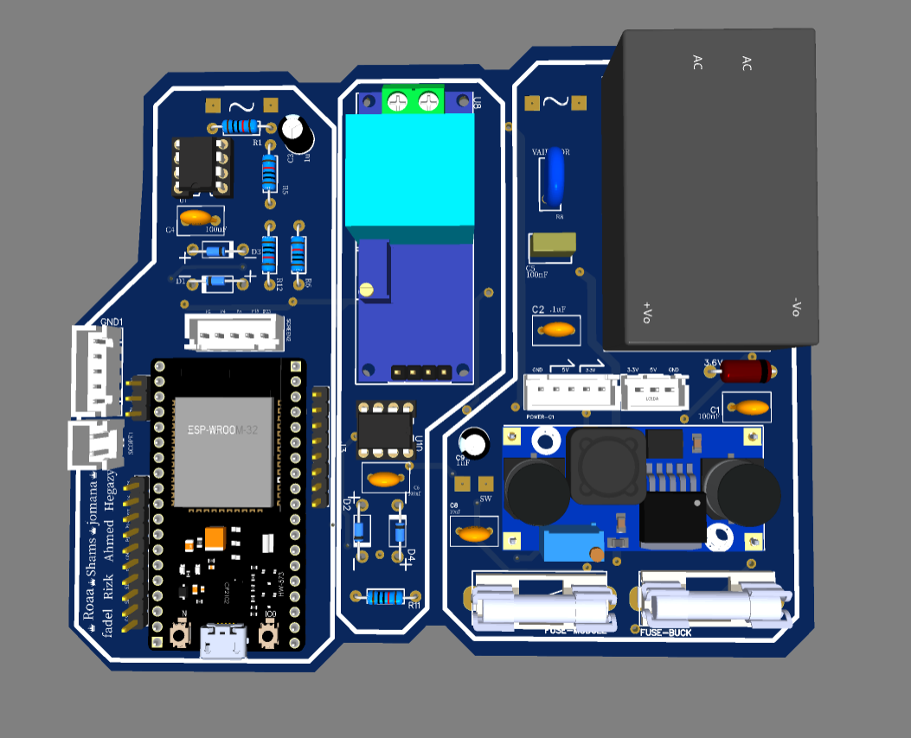
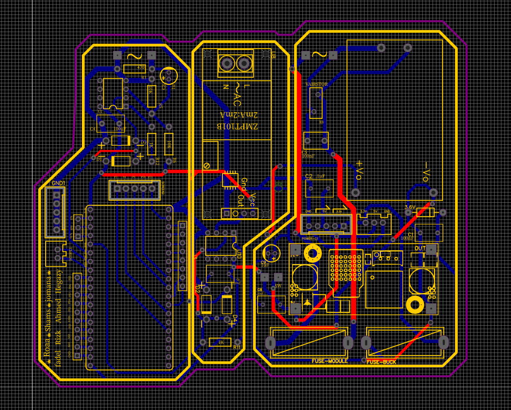

## Meet the Hardware 🔧⚡

This is the part where Wattzilla actually touches the real world.

The hardware is responsible for sensing voltage and current signals, preparing them safely for the ESP32, and making sure the data is ready for calculation and display.

In simple words:  
the hardware measures, the ESP32 thinks, and Wattzilla shows the results. 🔥

### Hardware Components Used

- NodeMCU-32S / ESP32 Development Board  
  Used as the main controller for reading signals, processing measurements, calculating electrical parameters, and communicating with the display.

- ZMPT101B Voltage Sensor Module  
  Used to sense the AC voltage signal and provide a low-voltage signal suitable for processing.

- Current Sensing Circuit  
  Used to measure the load current and send the current signal to the ESP32 for analysis.

- LM2596 DC-DC Buck Converter  
  Used to step down the input supply and provide a stable DC voltage for the circuit.

- HLK-PM01 AC-DC Power Module  
  Used to convert AC input power into DC power for the low-voltage electronics.

- Operational Amplifier Signal Conditioning Circuits  
  Used to amplify, shift, and condition the voltage and current signals before entering the ESP32 ADC pins.

- Protection Diodes  
  Used to protect the ESP32 input pins from unwanted voltage spikes.

- Resistors and Capacitors  
  Used for filtering, biasing, gain control, and signal stabilization.

- Fuses  
  Used for circuit protection and safer operation.

- Connectors and Headers  
  Used for power input, sensor connections, screen connection, and external wiring.

## Hardware Design Photos 📸

## Hardware Design Photos 📸

### Schematic Design

### PCB Routing

### PCB Layout

- Senses AC voltage
- Senses load current
- Conditions analog signals before entering the ESP32
- Protects the microcontroller inputs
- Supplies stable power to the circuit
- Sends processed data to the display
- Supports calculations such as power, power factor, THD, waveforms, and harmonics

The hardware design was tested and improved through multiple debugging stages to reach more stable readings
