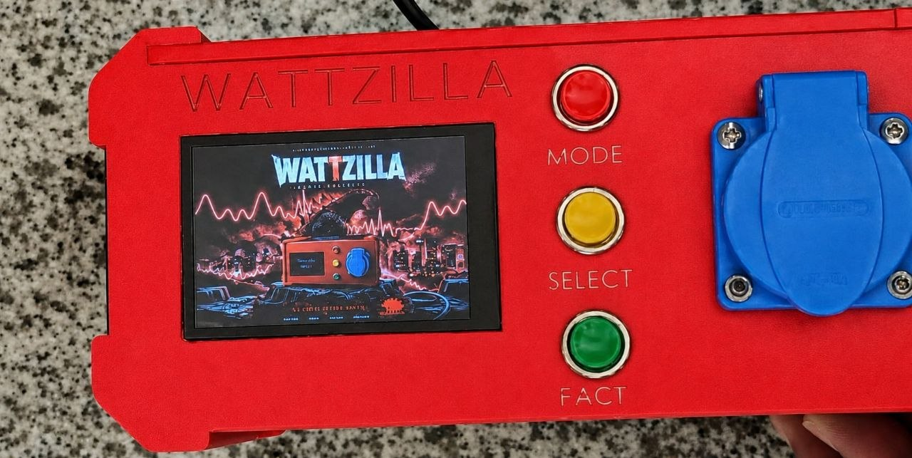

# Wattzilla ⚡  
## Smart Power Analyzer – First Version

Wattzilla is a smart power analyzer designed to measure and analyze important electrical parameters in an easy and practical way.

The project can measure voltage, current, power, power factor, THD, and it can also display voltage and current waveforms, in addition to harmonics analysis.

This first version was developed as a practical engineering project to understand power measurement, signal processing, sensors, and real-time data analysis.

---

## Project Photos

## Watch Wattzilla in Action 🔥

Here are some videos showing our first version during testing and operation 👇

- 🎥 [Testing the Device](https://drive.google.com/file/d/10lg5OqXyU0H7uzgqMx0n-3jCb21rePA3/view?usp=drivesdk)
- ⚡ [Wattzilla Live Demo](https://drive.google.com/file/d/1T5FBQeORNxcYiEMIY0t_zHyq25A9lSuH/view?usp=drivesdk)

## Features

- Voltage measurement  
- Current measurement  
- Power measurement  
- Power factor calculation  
- THD analysis for voltage and current  
- Voltage waveform display  
- Current waveform display  
- Harmonics analysis  

---

## How It Works

The system takes samples from the voltage and current signals using the ESP microcontroller.  
These samples are processed to calculate the electrical parameters and analyze the waveform behavior.

The measured data is then displayed to help understand the power quality and performance of the connected load.

---

## Project Status

This is the first version of Wattzilla.  
More improvements, testing, and documentation will be added later.

